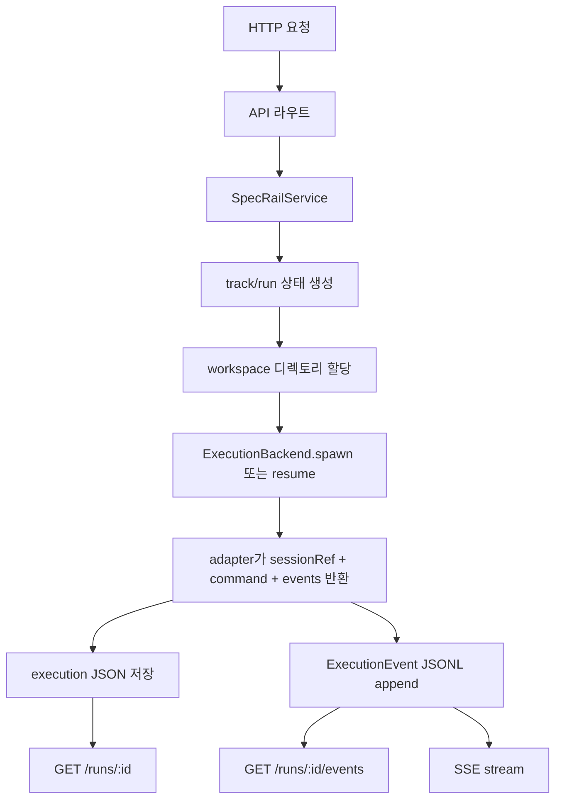
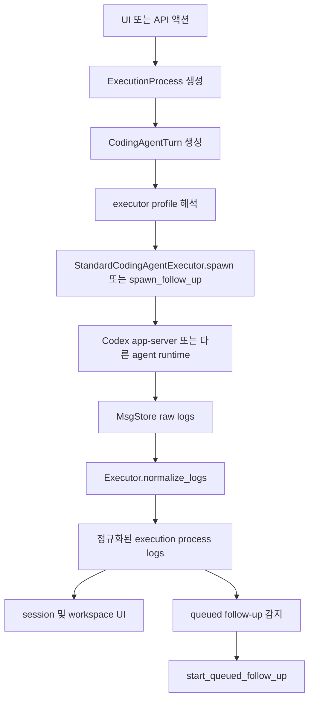
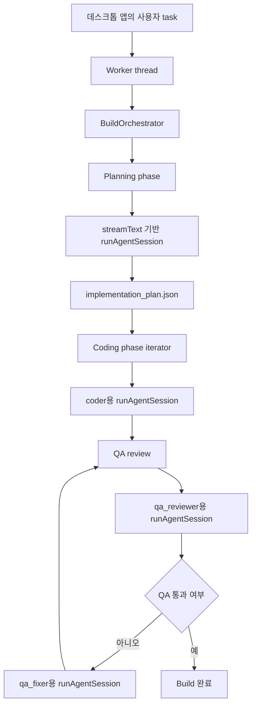
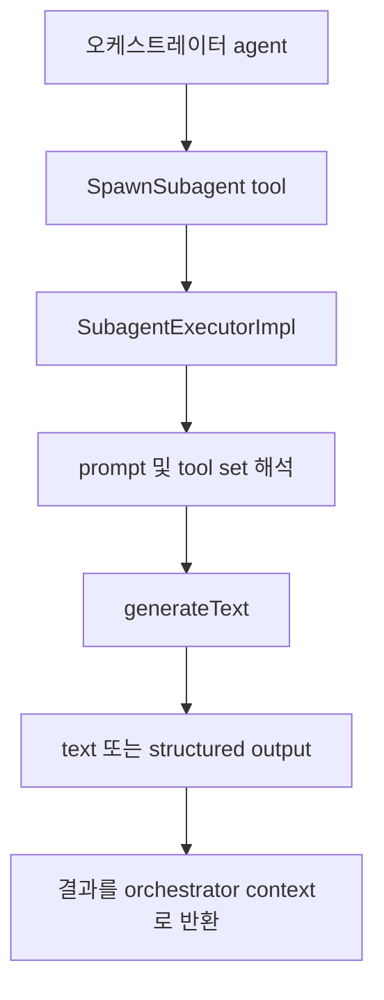
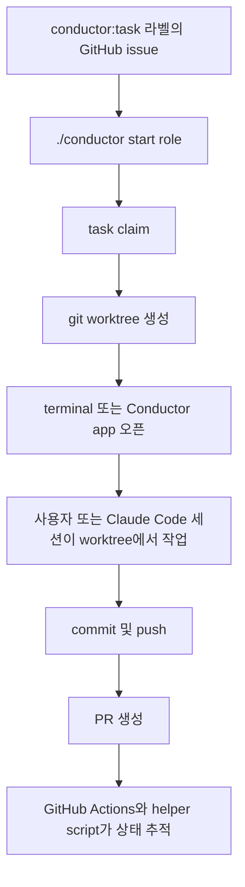

# 코딩 에이전트 호출 방식 분석

## 범위

이 문서는 다음 네 시스템이 코딩 에이전트를 어떻게 호출하고 조정하는지 비교합니다.

- `specrail` (현재 저장소)
- `vibe-kanban`
- `auto-claude` (현재 제품명은 Aperant, 저장소 이름은 `Auto-Claude`)
- `conductor` (`code-conductor`)

분석을 위해 외부 저장소를 다음 경로에 clone 해서 확인했습니다.

- `/Users/yoophi/private/2026-04-09/external-agent-orchestrators/vibe-kanban`
- `/Users/yoophi/private/2026-04-09/external-agent-orchestrators/auto-claude`
- `/Users/yoophi/private/2026-04-09/external-agent-orchestrators/conductor`

이번 문서의 초점은 좁게 잡았습니다.

- 각 시스템이 어디에서 에이전트 세션을 생성하는지
- CLI, SDK, app server, 사람 주도 터미널 workflow 중 무엇을 실제 호출 단위로 삼는지
- follow-up, 세션 연속성, worktree 격리, 로그/이벤트 정규화를 어떻게 처리하는지

## 요약

| 시스템 | 호출 방식 | 세션 연속성 | 격리 모델 | 정규화된 이벤트 모델 | 오케스트레이션 스타일 |
| --- | --- | --- | --- | --- | --- |
| `specrail` | 파일 기반 서비스가 adapter 인터페이스를 호출 | 있음, `sessionRef` 기반 | 전용 workspace 디렉토리 | 있음, 작은 공통 `ExecutionEvent` 스키마 | 중앙 서비스 오케스트레이션 |
| `vibe-kanban` | 백엔드가 `ExecutionProcess`를 만들고 executor 구현체를 호출 | 있음, `session_id`와 follow-up queue 기반 | workspace + git worktree + session 레코드 | 있음, executor별 로그 정규화 | 런타임 제어가 강한 플랫폼형 오케스트레이션 |
| `auto-claude` | TypeScript 오케스트레이터가 Vercel AI SDK 세션을 직접 호출 | 있음, session runner와 continuation 기반 | task별 git worktree | 부분적으로 있음, worker 메시지와 task log 중심 | 인프로세스 멀티에이전트 파이프라인 |
| `conductor` | 사람/Claude Code 세션을 위한 shell bootstrap workflow | 약함, 주로 task/worktree 연속성 수준 | task별 git worktree | 강한 공통 이벤트 버스는 없음 | GitHub issue 중심 coordination |

## 1. SpecRail

### 호출 경로

`specrail`은 API 레이어에서 직접 CLI나 SDK를 호출하는 구조가 아니라, 서비스 경계를 중심으로 설계되어 있습니다.

흐름은 다음과 같습니다.

1. HTTP 라우트가 요청을 파싱합니다.
2. `SpecRailService`가 track/run 상태와 workspace 경로를 만듭니다.
3. 서비스가 `ExecutionBackend` 인터페이스를 호출합니다.
4. adapter가 `sessionRef`, command metadata, normalized events를 반환합니다.
5. 상태를 JSON/JSONL로 저장하고 HTTP/SSE로 다시 노출합니다.

관련 파일:

- `apps/api/src/index.ts`
- `packages/core/src/services/specrail-service.ts`
- `packages/adapters/src/providers/codex-adapter.stub.ts`
- `packages/core/src/services/file-repositories.ts`

### 현재 흐름

### 좋은 점

- 호출 경계가 명확하고 테스트하기 쉽습니다.
- API는 backend가 Codex인지 Claude인지 알 필요가 없습니다.
- `sessionRef`가 이미 durable continuity state로 모델링돼 있습니다.
- raw provider output이 서비스 바깥으로 새지 않고 정규화된 이벤트로 수렴합니다.

### 현재 한계

현재 `CodexAdapterStub`은 메타데이터 저장과 lifecycle 이벤트 생성까지만 담당합니다. 구조적 방향은 좋지만, 실제 에이전트 프로세스를 실행하는 런타임 구현은 아직 placeholder 수준입니다.

## 2. Vibe Kanban

### 호출 경로

`vibe-kanban`은 비교 대상 중 가장 완성도 높은 런타임 오케스트레이션 시스템입니다.

백엔드가 정식 실행 단위를 만들고, typed executor 구현체에 실제 실행을 위임합니다.

- `ExecutionProcess`가 durable runtime unit입니다.
- `ExecutorActionType::CodingAgentInitialRequest`와 `CodingAgentFollowUpRequest`가 initial/follow-up 실행을 구분합니다.
- container service가 executor profile과 effective working directory를 해석합니다.
- `Codex` 같은 executor 구현체가 `spawn`, `spawn_follow_up`, `normalize_logs`를 구현합니다.

관련 파일:

- `crates/services/src/services/container.rs`
- `crates/local-deployment/src/container.rs`
- `crates/executors/src/executors/mod.rs`
- `crates/executors/src/executors/codex.rs`
- `crates/executors/src/executors/codex/slash_commands.rs`

### Codex 전용 동작

Codex의 경우 `vibe-kanban`은 단순히 `codex exec "prompt"`를 한 번 호출하는 방식이 아닙니다.

대신 Codex app-server 경로를 사용합니다.

- command builder가 `codex app-server`를 생성합니다.
- thread start params에 sandbox, approval policy, model, provider, base instructions, developer instructions를 넣습니다.
- follow-up은 기존 thread/session을 fork 해서 이어갈 수 있습니다.
- executor 전용 로그를 다시 공통 process log로 normalize 합니다.

### 흐름

### 핵심 특징

- session, workspace, execution process, coding agent turn이 분리된 강한 런타임 모델
- 실제 follow-up chaining 지원
- executor capability 모델 존재
- executor별 normalization layer 존재
- worktree/workspace/UI/devserver가 하나의 플랫폼 런타임 안에 연결됨

### 해석

`vibe-kanban`은 에이전트 호출을 제품의 핵심 런타임으로 취급합니다. 가벼운 orchestration service라기보다 로컬 실행 플랫폼에 가깝습니다.

## 3. Auto-Claude / Aperant

### 호출 경로

`auto-claude`는 `specrail`, `vibe-kanban`과 구조가 다릅니다.

이 시스템은 외부 coding CLI를 감싸는 것을 주 실행 단위로 삼지 않습니다. 대신 TypeScript 기반 AI 런타임을 Vercel AI SDK v6 위에 올려서 사용합니다.

- `runAgentSession()`이 `streamText()`를 사용합니다.
- orchestrator가 planner, coder, QA reviewer, QA fixer 단계를 코드로 직접 실행합니다.
- worker thread로 긴 에이전트 세션을 Electron main process와 분리합니다.
- nested subagent는 main streamed session이 아니라 `generateText()`로 실행합니다.

관련 파일:

- `apps/desktop/src/main/ai/session/runner.ts`
- `apps/desktop/src/main/ai/orchestration/build-orchestrator.ts`
- `apps/desktop/src/main/ai/orchestration/parallel-executor.ts`
- `apps/desktop/src/main/ai/agent/worker.ts`
- `apps/desktop/src/main/ai/tools/builtin/spawn-subagent.ts`
- `apps/desktop/src/main/ai/orchestration/subagent-executor.ts`

### 흐름

### Subagent 경로

`auto-claude`는 중첩 위임도 명시적으로 지원합니다.

### 해석

이 시스템은 인프로세스 멀티에이전트 프레임워크에 가장 가깝습니다.

- orchestration logic과 agent runtime이 같은 애플리케이션 안에 있습니다.
- phase logic이 코드에 명시적으로 들어 있습니다.
- subagent는 기본적으로 별도 OS process가 아닙니다.
- worktree 격리는 존재하지만, 핵심 추상화는 generic execution backend가 아니라 SDK session pipeline입니다.

## 4. Conductor

### 호출 경로

`conductor`는 다른 셋보다 훨씬 가볍습니다. 핵심은 다음 조합입니다.

- `conductor:task` 라벨이 붙은 GitHub issue
- git worktree
- `.conductor/roles/*.md` 역할 정의
- wrapper script와 GitHub Actions

관련 파일:

- `README.md`
- `docs/ARCHITECTURE.md`
- `docs/AGENT_WORKFLOW.md`
- `docs/USAGE.md`
- `conductor-init.sh`

루트의 `conductor` 명령은 사실상 wrapper입니다.

- `./conductor`는 `.conductor/scripts/conductor`로 위임됩니다.

문서가 보여주는 기본 모델은 다음과 같습니다.

- agent가 GitHub issue를 claim 합니다.
- worktree를 만듭니다.
- 사용자나 Claude Code 세션이 그 worktree에서 작업합니다.
- 진행 상황은 GitHub와 helper script로 추적합니다.

### 흐름

### 해석

`conductor`는 깊은 런타임 invocation framework가 아닙니다. 기존 agent session을 둘러싼 bootstrap-and-coordination layer에 가깝습니다. 실제 coding agent 호출은 주로 사용자 터미널, Claude Code 세션, 앱 환경 밖으로 빠져 있습니다.

## 호출 철학별 비교

### 1. Service boundary 우선: `specrail`

`specrail`은 다음을 모델링합니다.

- project state
- track state
- run state
- normalized events

백엔드 orchestration service로 발전하려면 가장 깔끔한 출발점입니다.

### 2. Execution platform 우선: `vibe-kanban`

`vibe-kanban`은 다음을 모델링합니다.

- workspaces
- sessions
- execution processes
- executor capabilities
- live log normalization

SpecRail이 본격적인 로컬/runtime execution plane을 갖추고 싶다면 가장 참고할 가치가 큽니다.

### 3. In-process agent framework 우선: `auto-claude`

`auto-claude`는 다음을 모델링합니다.

- planner/coder/QA를 코드상 phase로 명시
- `streamText()`와 `generateText()` 세션을 native invocation primitive로 사용
- generic external-process abstraction보다 worker-thread 기반 격리 선호

SpecRail이 orchestration logic을 agent runtime 내부로 더 깊게 가져가고 싶을 때 참고할 모델입니다.

### 4. Task bootstrap 우선: `conductor`

`conductor`는 다음에 강합니다.

- issue claim
- role guidance
- worktree 준비

반면 실제 runtime control은 얕습니다.

즉, durable runtime control 참고용보다는 빠른 도입/온보딩 패턴 참고용입니다.

## SpecRail이 배워야 할 점

### Vibe Kanban에서

- run을 더 풍부한 `ExecutionProcess` 개념으로 승격
- initial request와 follow-up request를 명시적으로 분리
- backend별 로그 정규화를 adapter 책임으로 이동
- backend capability 모델 도입

### Auto-Claude에서

- orchestration phase와 session runtime을 분리
- planner/coder/QA phase를 프롬프트 텍스트가 아니라 1급 개념으로 승격
- nested delegation을 top-level run spawning과 구분

### Conductor에서

- 온보딩과 task bootstrap은 단순하게 유지
- issue/task intake는 가볍게 설계
- human-driven usage와 agent-driven usage가 공존할 수 있게 구성

## 결론

`specrail`이 현재 목표를 유지하려면 가장 적절한 방향은 다음입니다.

- 현재의 service-oriented architecture는 유지
- `vibe-kanban`의 richer execution/runtime model 차용
- `auto-claude`의 explicit multi-phase orchestration 개념 차용
- `conductor`의 script-only 패턴은 온보딩 helper 정도로만 제한적으로 참고
