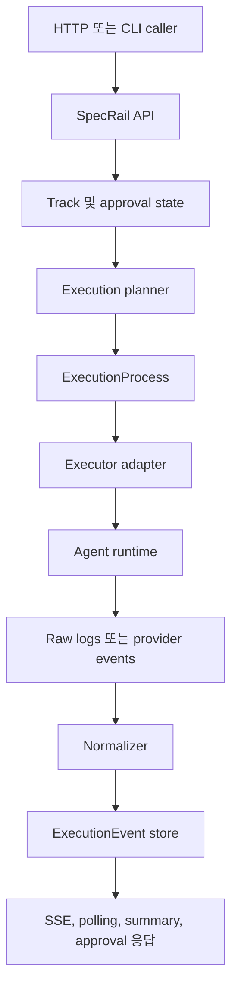
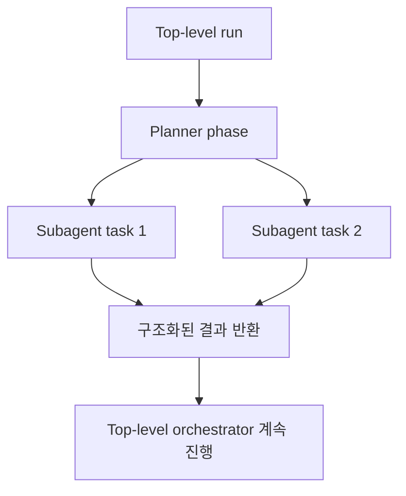
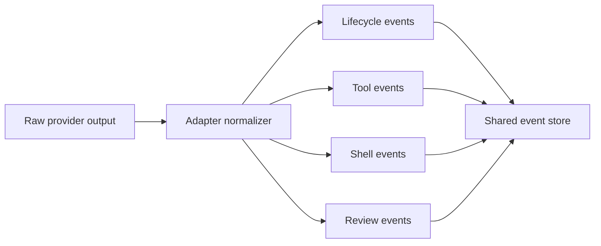

# SpecRail용 에이전트 호출 설계 노트

## 목표

비교 분석 내용을 SpecRail 설계 방향으로 번역합니다.

## 현재 SpecRail의 위치

지금의 SpecRail은 다음처럼 볼 수 있습니다.

- artifact-first control plane
- 가벼운 run registry
- placeholder 수준의 executor adapter

출발점 자체는 좋습니다. 부족한 것은 API 모양이 아니라 execution plane의 깊이입니다.

## 권장 목표 구조

SpecRail은 다음 계층 구조로 발전하는 것이 적절합니다.

## 추가를 권장하는 개념

### 1. Run 의도와 실제 실행을 분리

현재 `Execution`도 유용하지만 아직은 너무 얇습니다.

다음 수준의 execution-process 계층을 추가하는 것이 좋습니다.

- `initial_request` 와 `follow_up_request`
- `setup`, `coding_agent`, `cleanup`, `review`, `dev_server` 같은 run reason
- process별 status와 exit metadata
- session lineage와 process lineage를 더 명확히 분리

이 부분은 `vibe-kanban`에서 가장 강하게 배울 수 있는 포인트입니다.

### 2. 세션 연속성을 1급 상태로 유지

continuity를 provider-specific payload 안에 숨기지 않는 편이 좋습니다.

다음 필드는 1급 상태로 남겨두는 것이 낫습니다.

- `sessionRef`
- `resumeFromRunId`
- `resumeFromEventId` 또는 이에 준하는 checkpoint
- backend가 session fork를 지원할 때의 `forkedFromSessionRef`

이렇게 해야 Codex, Claude Code, Gemini, 향후 다른 runtime에도 중립적인 모델이 됩니다.

### 3. Adapter 위에 phase-aware orchestration 추가

모든 orchestration 패턴을 adapter 안에 몰아넣는 것은 좋지 않습니다.

권장 분리는 다음과 같습니다.

- service/orchestrator layer: `planning`, `coding`, `qa_review`, `qa_fixing` 같은 phase 소유
- adapter layer: 한 agent session을 시작, 재개, 리뷰, 취소하는 법만 소유

이 구조는 `auto-claude`의 장점을 가져오는 방식입니다. phase logic은 raw session runtime보다 위 계층에 있어야 합니다.

### 4. Subagent와 top-level run을 분리

중첩 위임은 top-level run 생성과 같은 행위가 아닙니다.

별도 개념으로 두는 편이 좋습니다.

- top-level run: durable, user-visible, resumable
- subagent task: 상위 context를 상속받지만 더 좁은 write scope를 가진 bounded child execution

## 권장 호출 인터페이스

### Execution backend

현재 `spawn / resume / cancel` 모양은 유지할 수 있지만, 아래처럼 확장하는 편이 좋습니다.

- `spawnInitial`
- `spawnFollowUp`
- `spawnReview`
- `cancel`
- `discoverCapabilities`
- `normalizeLogs`

### Execution process 모델

권장 필드 예시는 다음과 같습니다.

- `id`
- `runId`
- `kind`
- `backend`
- `profile`
- `workspacePath`
- `sessionRef`
- `parentProcessId`
- `status`
- `startedAt`
- `finishedAt`
- `exitCode`
- `request`
- `summary`

## 이벤트 전략

현재 이벤트 스키마 방향 자체는 좋습니다. 작은 공통 모델은 유지하는 편이 맞습니다.

다만 이벤트 계열은 좀 더 분명하게 나누는 편이 좋습니다.

- lifecycle events
- tool events
- shell events
- artifact events
- approval events
- review events
- summary 또는 checkpoint events

## 그대로 가져오면 안 되는 것

### `conductor`의 런타임 모델은 그대로 가져오지 말 것

`conductor`는 bootstrap과 issue-driven task intake에는 유용하지만, durable execution runtime은 아닙니다. SpecRail이 shell script와 GitHub issue 규칙의 묶음으로 축소되면 제품 목표와 맞지 않습니다.

### orchestration을 하나의 SDK에 고정하지 말 것

`auto-claude`는 orchestration 개념을 잘 드러내지만, SpecRail은 특정 인프로세스 SDK 경로 하나에 묶이지 않는 편이 좋습니다. 제품 가설이 더 넓기 때문입니다.

### provider semantics를 API route로 끌어올리지 말 것

provider-specific 디테일은 adapter와 execution process 레코드 안에 가두는 편이 맞습니다.

## 구체적인 다음 단계

1. 현재 단일 `Execution` lifecycle을 `Run` + `ExecutionProcess` 구조로 분리
2. adapter contract를 stub lifecycle metadata에서 실제 runtime invocation 중심으로 확장
3. service boundary에서 initial request와 follow-up request를 명시적으로 분리
4. planning/coding/review phase를 담당하는 orchestration layer 추가
5. artifact-first 상태 관리는 유지하되, event normalization을 adapter의 필수 책임으로 승격
6. 나중에 issue intake나 task templating용 bootstrap helper를 가볍게 추가하되, `conductor`의 가장 단순한 부분만 제한적으로 차용

## 한 문장 결론

SpecRail은 shell-script task framework도 아니고 단일-SDK 데스크톱 orchestrator도 아니라, 더 풍부한 execution-process 모델을 가진 service-oriented orchestration control plane으로 가는 것이 맞습니다.
