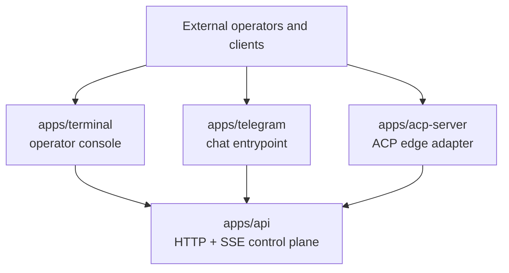
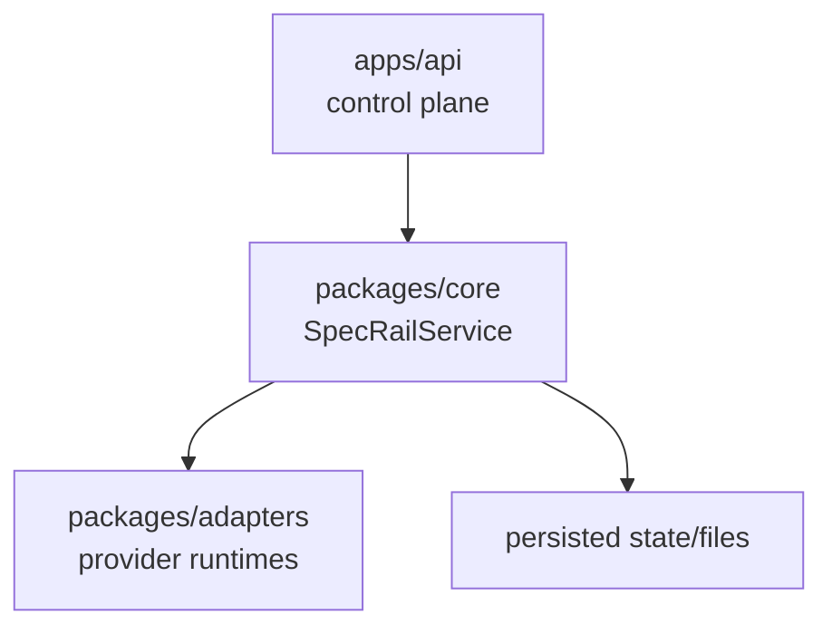
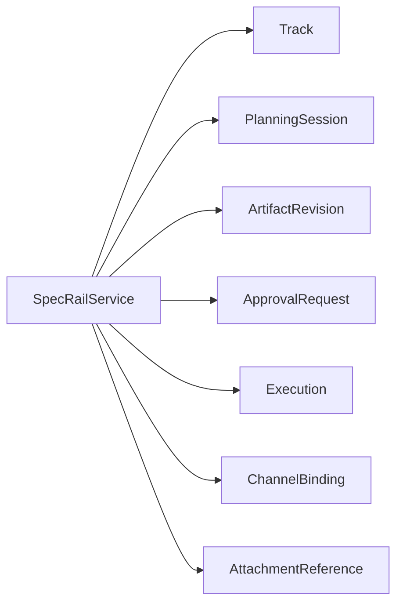
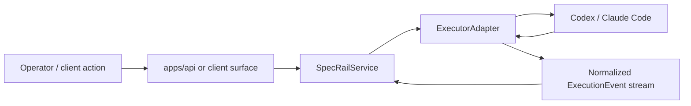
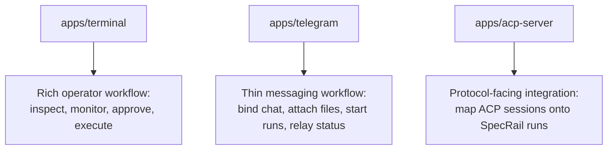

# Client surfaces and structure

## Summary

SpecRail currently has three meaningful client-facing surfaces:

- `apps/terminal`: the most complete operator-facing client
- `apps/telegram`: a thin chat frontend that binds external conversations into SpecRail tracks and runs
- `apps/acp-server`: an ACP-facing edge adapter for external ACP-native clients

These do **not** own the main workflow state themselves.
They sit on top of SpecRail's existing control-plane and domain model.

The structural rule is:

- `packages/core` + `SpecRailService` remain the orchestration center
- `apps/api` remains the system-of-record API
- `packages/adapters` remains the execution-backend abstraction layer
- terminal, telegram, and ACP surfaces remain thin client/edge layers over that core

## Current client implementation status

### 1. Terminal client (`apps/terminal`)

This is currently the most complete client surface.

Implemented capabilities:

- track list and run list views
- selected detail inspection for tracks and runs
- live run event monitoring over SSE
- run filtering (`all`, `active`, `terminal`)
- tail pause/resume controls
- planning session, revision, and approval inspection
- approval actions (approve/reject)
- revision focus switching and revision browsing
- lightweight revision proposal authoring
- run start / resume / cancel
- backend / profile selection

Practical interpretation:

- this is now an **operator console MVP**
- it is the most capable surface for day-to-day operational work
- its remaining work is mostly UX refinement, not missing architectural foundations

### 2. Telegram client (`apps/telegram`)

This is a thin chat/frontend surface rather than a full workflow UI.

Implemented responsibilities:

- channel binding lookup and creation
- track creation when a chat/thread is not yet bound
- attachment reference registration for Telegram uploads
- run start via the SpecRail API
- relaying run progress back into Telegram

Practical interpretation:

- Telegram is currently a **chat entrypoint** into SpecRail
- it is good for lightweight task initiation and status relay
- it is not intended to replace the richer operator workflow available in the terminal client

### 3. ACP edge surface (`apps/acp-server`)

This is not a traditional user client, but an edge adapter that allows ACP-native clients to connect.

Implemented responsibilities:

- ACP stdio JSON-RPC server
- `initialize`
- `session/new`
- `session/load`
- `session/list`
- `session/prompt`
- `session/cancel`
- ACP session to SpecRail run mapping
- event replay for existing sessions
- permission/approval round-tripping at an initial useful level

Practical interpretation:

- ACP is currently an **integration surface**, not a replacement control plane
- it allows ACP-native clients to speak to SpecRail without replacing the existing domain model
- it is still earlier-stage than the terminal client

## Structural layering

### Core orchestration layer

- `packages/core`
- `packages/core/src/services/specrail-service.ts`

This is the actual center of the system.

Important persisted domain concepts include:

- `Track`
- `PlanningSession`
- `ArtifactRevision`
- `ApprovalRequest`
- `Execution`
- `ChannelBinding`
- `AttachmentReference`

This layer owns:

- workflow state
- planning/approval rules
- execution lifecycle rules
- reconciliation logic
- durable system behavior

### Execution backend abstraction

- `packages/adapters`

This layer hides provider-specific runtime behavior behind a smaller shared contract.

Current backend family examples:

- Codex
- Claude Code

Responsibilities include:

- spawn / resume / cancel
- provider session metadata normalization
- provider event normalization into shared `ExecutionEvent`
- runtime-specific process/session handling

### System-of-record API

- `apps/api`

This is the primary control-plane surface.

It provides:

- track APIs
- run APIs
- planning/revision/approval APIs
- channel binding and attachment APIs
- SSE event streaming

This layer is the canonical integration point for SpecRail-native operations.

### Client and edge surfaces

- `apps/terminal`
- `apps/telegram`
- `apps/acp-server`

These layers should be understood as **thin surfaces over the control plane**, not as parallel systems with their own source of truth.

Their job is to:

- present workflows
- translate external interaction patterns
- call into the API/service layer
- reflect persisted SpecRail state back to operators or connected clients

## Structural diagrams

### 1. High-level client surface map

### 2. Runtime and orchestration structure

### 3. Domain and persistence focus

### 4. Execution backend flow

### 5. Client surface roles

## Maturity assessment

### Most mature

- terminal client

Why:

- it covers inspection, monitoring, planning, approval, and execution actions
- it already behaves like an operator console rather than a thin prototype

### Moderately mature

- telegram client

Why:

- it cleanly covers the thin chat-entry use case
- it is intentionally narrow, so maturity should be judged against that smaller scope

### Early but meaningful

- ACP edge adapter

Why:

- it already demonstrates the correct boundary choice
- it supports useful session/run mapping and approval round-tripping
- but it is still an early adapter surface compared with terminal UX depth

## What is not yet present or still comparatively weak

### Web client

There is no dedicated web client yet.

That means:

- terminal remains the main rich operator UI
- Telegram remains a thin chat surface
- ACP remains an integration surface, not a full UI

### Terminal UX polish

The terminal client now has broad capability, but it still has room for:

- better input/composer UX
- layout/focus polish
- keymap/help discoverability
- denser but clearer visual summaries

### ACP depth

ACP now has a meaningful edge-adapter implementation, but it still has room for:

- richer event fidelity
- deeper approval/runtime brokerage
- stronger client-native interaction semantics over time

### Telegram depth

Telegram is intentionally thin.

That means:

- it is good for entry and relay
- it is weaker for planning-heavy or revision-heavy workflows
- it should stay thin unless there is a deliberate product decision to make chat-first planning a major surface

## Recommended interpretation going forward

The current client strategy is coherent:

- **terminal** as the main operator console
- **telegram** as the messaging/chat ingress surface
- **ACP** as the protocol-facing integration surface
- **API + core service** as the system of record

That is a good shape for SpecRail because it keeps domain ownership centralized while allowing different client surfaces to evolve independently.

If more client work happens next, the most natural order is:

1. continue terminal UX refinement
2. decide whether a web client is needed for approval/revision-heavy workflows
3. keep ACP as an edge adapter, not as a replacement for the control plane
