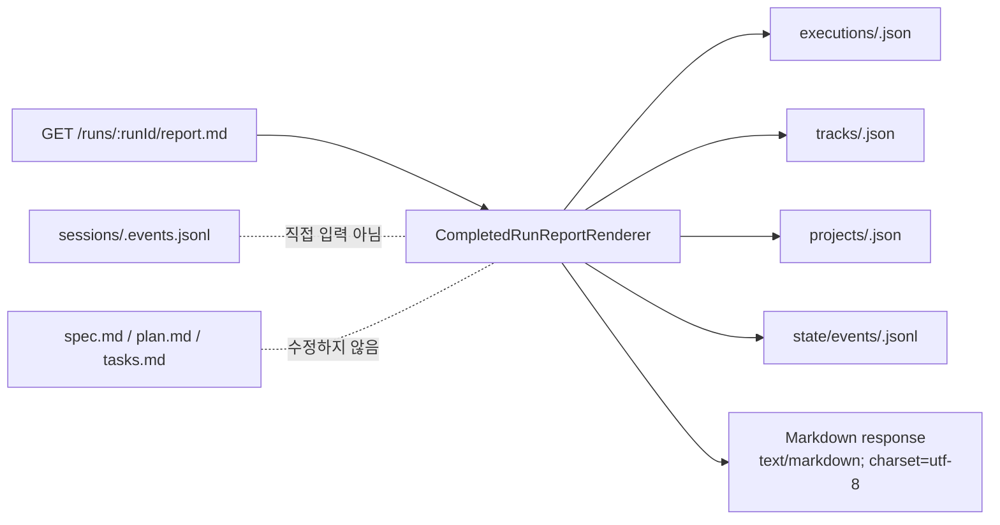

# Completed Run Report Export Design

## 목적

완료된 run의 요약과 주요 이벤트를 Markdown 보고서로 명시적으로 export하는 계약을 정의한다.

이 export는 운영자 보고, PR comment, 릴리스 노트 초안, 작업 인수인계에 쓰기 위한 **derived artifact**다. `spec.md`, `plan.md`, `tasks.md` 같은 planning artifact를 자동으로 수정하지 않는다.

## 배경 결정

SpecRail의 canonical run history는 계속 `state/events/<runId>.jsonl`이다.

- HTTP history: `GET /runs/:runId/events`
- SSE replay/live stream: `GET /runs/:runId/events/stream`
- run summary/status recomputation: `executions/<runId>.json` + canonical event log
- provider telemetry: `sessions/<sessionRef>.events.jsonl`

Export 결과물은 특정 시점의 canonical state를 읽어 사람이 보기 쉽게 렌더링한 스냅샷이다. 이후 이벤트가 추가되면 export는 자동 갱신되지 않는다.

## 선택한 1차 표면

1차 구현 표면은 **read-only HTTP endpoint + 내부 renderer**로 둔다.

```text
GET /runs/:runId/report.md
```

이유:

- Hosted Operator UI, Terminal, Telegram, ACP edge adapter가 모두 같은 HTTP API를 재사용할 수 있다.
- 파일 쓰기 없이 Markdown 본문을 응답하므로 planning artifact와 분리된다.
- 이후 CLI/admin command는 같은 renderer를 호출하는 얇은 wrapper로 추가할 수 있다.

CLI/admin wrapper는 다음 후속 slice에서 선택적으로 추가한다.

```text
specrail runs report <runId> --format markdown
```

## 읽기 전용성

`GET /runs/:runId/report.md`는 상태를 변경하지 않는다.

- `state/events/<runId>.jsonl`을 append하지 않는다.
- `executions/<runId>.json`을 update하지 않는다.
- `artifacts/tracks/<trackId>/{spec,plan,tasks}.md`를 수정하지 않는다.
- export 파일을 서버에 저장하지 않는다.

다운로드/저장은 호출자 책임이다.

## 데이터 입력

Renderer는 다음 데이터를 읽는다.

- execution: `ExecutionRepository.getById(runId)`
- track: `TrackRepository.getById(execution.trackId)`
- project: `ProjectRepository.getById(track.projectId)` when available
- events: `EventStore.listByExecution(runId)`

Renderer는 provider telemetry 파일을 직접 읽지 않는다. provider-specific detail은 이미 normalized event `payload`에 들어온 범위만 사용한다.



## Report 구조

Markdown report는 안정적인 섹션 순서를 유지한다.

```markdown
# Run Report — <runId>

## Summary
- Project: <project name> (<projectId>)
- Track: <track title> (<trackId>)
- Status: <status>
- Backend/Profile: <backend> / <profile>
- Started: <startedAt>
- Finished: <finishedAt>
- Event count: <summary.eventCount>
- Last event: <summary.lastEventSummary> (<summary.lastEventAt>)

## Prompt
<latest command.prompt>

## Planning Context
- Planning session: <planningSessionId or none>
- Spec revision: <specRevisionId or none>
- Plan revision: <planRevisionId or none>
- Tasks revision: <tasksRevisionId or none>

## Timeline
| Time | Type | Source | Summary |
| ---- | ---- | ------ | ------- |
| ...  | ...  | ...    | ...     |

## Highlights
- Approval requests/resolutions
- Tool calls/results
- Test results
- Terminal status changes

## Source of Truth
Generated from `state/events/<runId>.jsonl` at <generatedAt>.
This report is a derived snapshot and does not replace canonical run history.
```

### Timeline 규칙

- 기본은 모든 normalized event를 timestamp 순서로 렌더링한다.
- 매우 긴 run을 대비해 후속 구현에서 `?limit=` 또는 `?eventTypes=` filter를 추가할 수 있다.
- Markdown table cell은 `|`, newline 등 특수 문자를 escape한다.
- payload 전체 dump는 기본 포함하지 않는다. payload가 필요한 상세 보고서는 별도 `verbose` 옵션으로 확장한다.

### Highlights 규칙

초기 구현은 이벤트 타입 기반으로 단순 분류한다.

- `approval_requested`, `approval_resolved`
- `tool_call`, `tool_result`
- `test_result`
- `task_status_changed`
- `summary`

각 highlight는 event summary와 timestamp만 포함한다. provider-specific payload는 기본 숨긴다.

## 응답 계약

### Success

```http
HTTP/1.1 200 OK
Content-Type: text/markdown; charset=utf-8
Content-Disposition: inline; filename="specrail-run-<runId>-report.md"
```

### Errors

- `404`: run 없음
- `404`: linked track/project가 필수인데 없음
- `500`: 예상치 못한 renderer 실패

Renderer는 malformed event payload 때문에 실패하지 않아야 한다. summary/timestamp/type/source 같은 공통 필드만 신뢰한다.

## 테스트 전략

1차 구현에서 필요한 테스트:

- renderer unit test
  - metadata, prompt, planning context, timeline, source-of-truth footer 렌더링
  - Markdown escaping
  - provider payload 없이도 안정적으로 렌더링
- API integration test
  - `GET /runs/:runId/report.md` returns `text/markdown`
  - missing run returns `404`
  - endpoint가 track artifacts와 event log를 mutate하지 않음

## 후속 작업

1. `CompletedRunReportRenderer` 구현
2. `GET /runs/:runId/report.md` API 추가
3. Terminal/Hosted UI에서 report download link 노출
4. 필요한 경우 CLI/admin wrapper 추가
5. 긴 run을 위한 filter/limit/verbose 옵션 검토
