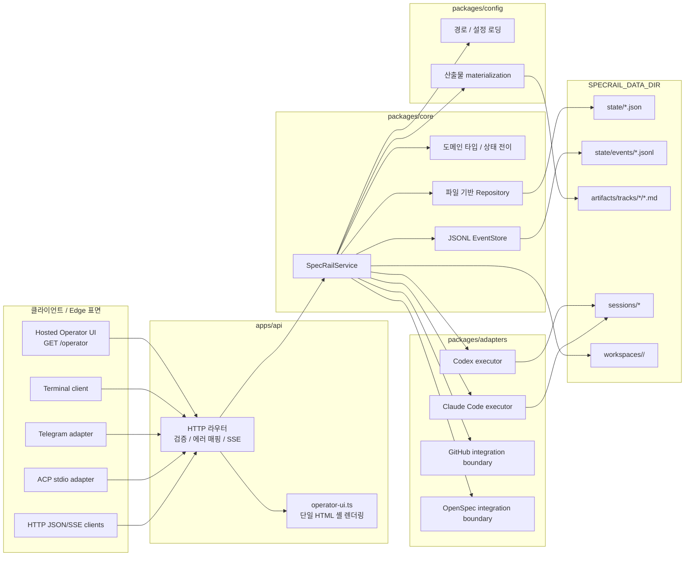
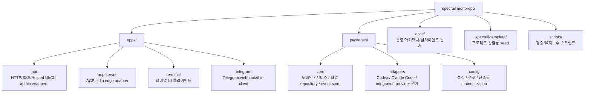
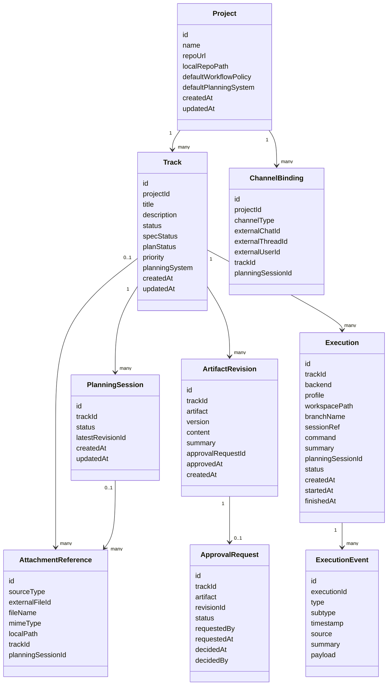
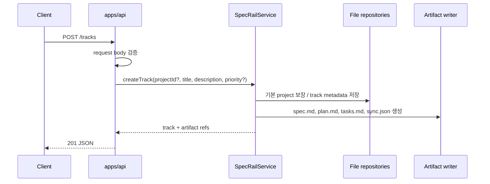
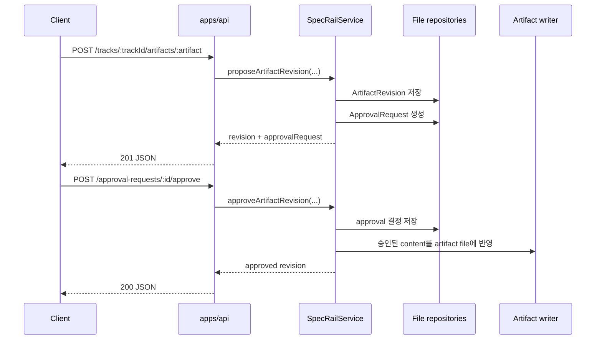
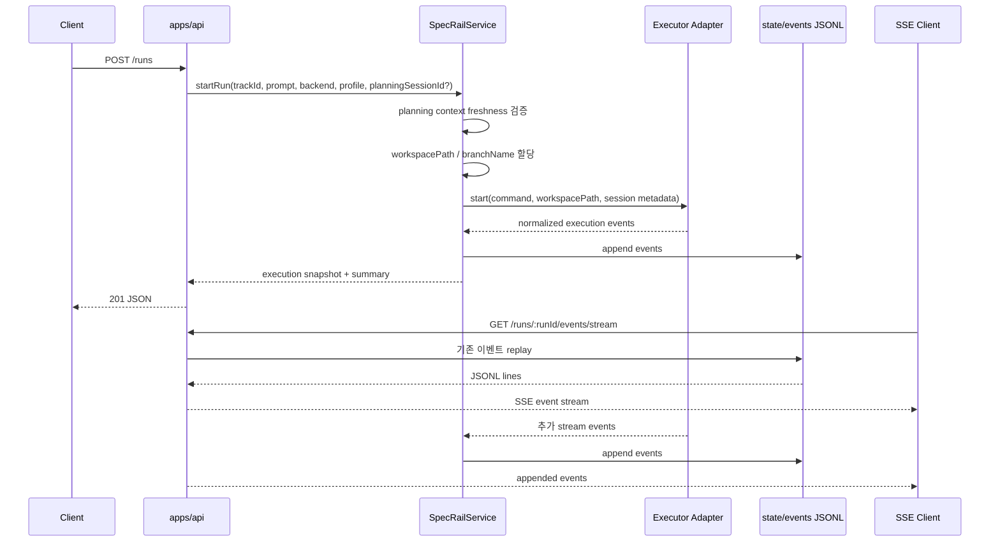
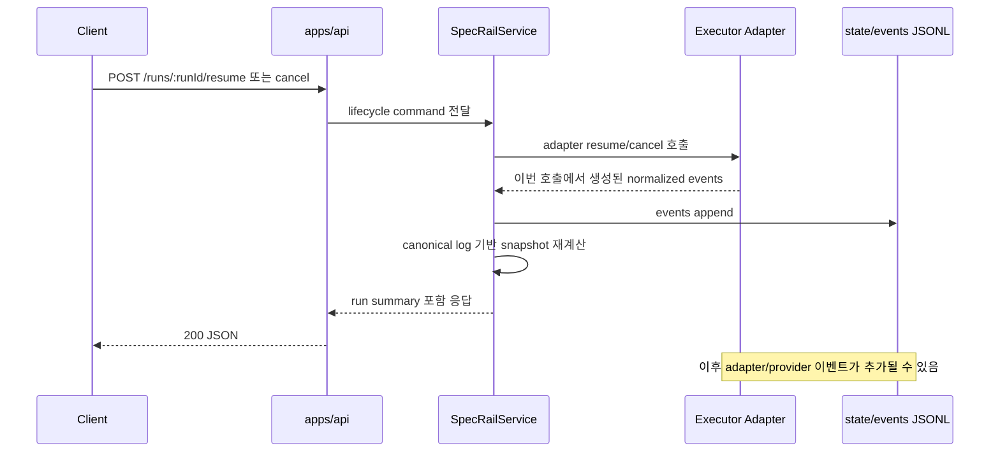
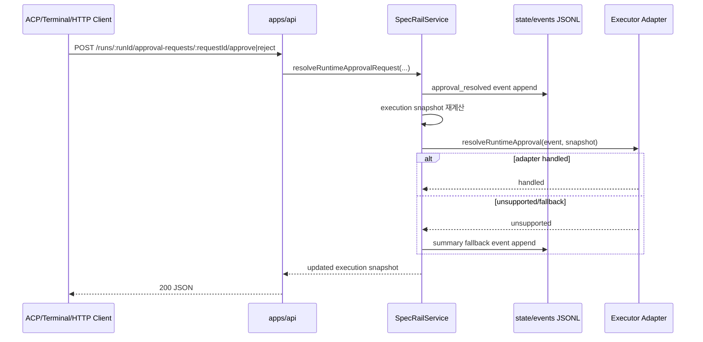
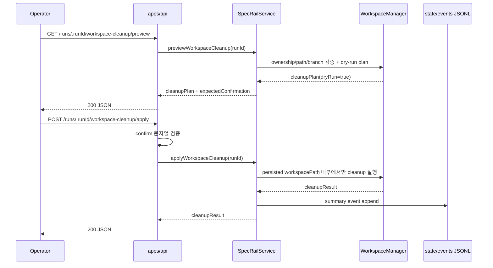

# SpecRail MVP 아키텍처

이 문서는 현재 구현된 SpecRail MVP의 실행 가능한 아키텍처를 기준으로 정리한다. 과거 설계 의도가 아니라, 현재 코드가 제공하는 서비스 경계, 데이터 흐름, 저장소 구조, 클라이언트 표면을 설명한다.

## 목표

SpecRail은 코딩 에이전트 작업을 `spec -> plan -> tasks -> run -> inspect/resume/cancel` 흐름으로 관리하는 파일 기반 오케스트레이션 서비스다.

현재 MVP의 핵심 목표는 다음과 같다.

- 프로젝트와 트랙 단위로 작업 맥락을 분리한다.
- `spec.md`, `plan.md`, `tasks.md`를 지속 가능한 산출물로 관리한다.
- 계획 세션, 산출물 제안, 승인/거절 흐름을 기록한다.
- Codex와 Claude Code 실행을 동일한 실행 이벤트 모델로 정규화한다.
- HTTP/JSON, SSE, Hosted Operator UI, Terminal, Telegram, ACP edge adapter가 같은 코어 서비스와 파일 상태를 바라보게 한다.
- 런 이벤트, 실행 메타데이터, 세션 메타데이터를 재시작/복구 가능한 형태로 저장한다.

## 전체 시스템 구조



## 계층별 책임

### 1. Control Plane

제품/작업/계획/산출물 상태를 소유한다.

구현된 기능:

- 기본 프로젝트 bootstrap
- 프로젝트 생성, 조회, 수정
- 트랙 생성, 조회, 목록, 정렬, 필터링
- 트랙 workflow 상태와 `specStatus`, `planStatus` 업데이트
- 트랙별 `spec.md`, `plan.md`, `tasks.md` 생성 및 승인된 revision materialization
- 계획 세션 생성과 계획 메시지 JSONL 저장
- `spec`, `plan`, `tasks` 산출물 revision 제안
- 산출물 approval request 생성, 승인, 거절
- 채널 바인딩과 첨부파일 reference 등록
- 실행 기록과 이벤트 로그를 통한 run summary 재계산

주요 파일:

- Markdown: `spec.md`, `plan.md`, `tasks.md`, 프로젝트 인덱스/워크플로우/트랙 요약
- JSON: project, track, planning session, artifact revision, approval request, channel binding, attachment, execution metadata
- JSONL: run events, planning messages, provider adapter events

### 2. Execution Plane

에이전트 실행 생명주기와 provider adapter 연동을 소유한다.

구현된 기능:

- run별 workspace 경로 할당
- `codex`, `claude_code` backend 선택
- backend/profile/sessionRef/provider metadata 영속화
- Codex spawn/resume/cancel 생명주기
- Claude Code process-backed 실행과 stream event 정규화
- run start/resume/cancel 이벤트 저장
- provider stdout/stderr, assistant message, tool call/result, approval-like signal을 공통 이벤트 모델로 승격
- planning context capture와 stale planning context run 거절
- runtime approval decision을 domain event로 기록하고 executor callback으로 전달
- terminal 결과 기반 track 상태 reconciliation
- workspace cleanup preview/apply 안전 흐름

아직 MVP 범위 밖:

- scheduler/queue 관리
- production-grade provider-native permission continuation
- 완전한 git branch/worktree orchestration 자동화

### 3. Interface Plane

외부 호출자가 SpecRail을 사용하는 표면을 소유한다.

구현된 표면:

- HTTP JSON API
- `GET /runs/:runId/events/stream` SSE
- `GET /operator` Hosted Operator UI
- Terminal client
- Telegram thin adapter
- ACP JSON-RPC stdio edge adapter
- GitHub/OpenSpec import/export 및 run-summary publication 경계

아직 MVP 범위 밖:

- production auth/authz
- multi-user access control
- hosted GitHub app/webhook 자동화
- database-backed persistence

## 현재 앱/패키지 소유권



### `packages/core`

- 도메인 타입과 enum
- artifact 문서 렌더링
- file-backed repositories
- execution event store와 planning-message store 계약 및 JSONL 구현
- `SpecRailService` orchestration
- track, planning, artifact approval, run, channel binding, attachment reference 유스케이스

### `packages/adapters`

- executor adapter 계약
- Codex adapter
- Claude Code adapter
- provider command/session metadata shape
- provider stream event -> 공통 execution event 변환
- OpenSpec/GitHub integration provider 경계

### `packages/config`

- 설정 로딩
- artifact/state/workspace 경로 규칙
- track artifact materialization helper
- terminal client config loading

### `apps/api`

- HTTP routing
- request validation
- structured API error mapping
- JSON/SSE response handling
- file-backed dependency composition
- configured executor wiring
- Hosted Operator UI HTML serving
- workspace cleanup preview/apply HTTP boundary
- CLI/admin wrappers around HTTP, OpenSpec, GitHub-oriented workflows

### `apps/acp-server`

- ACP JSON-RPC stdio edge adapter
- ACP session state under `state/acp-sessions/`
- ACP `session/new`, `session/prompt`, `session/cancel`, `session/load`, `session/list`를 SpecRail service call로 매핑
- execution event와 permission request를 ACP-facing projection으로 변환

### `apps/terminal`

- terminal client 상태와 렌더링
- track/run 목록과 상세 뷰
- planning/approval workspace 뷰
- backend/profile 선택
- run start/resume/cancel 제어
- live SSE follow mode와 event filter
- workspace cleanup preview/apply 제어

### `apps/telegram`

- Telegram webhook 처리
- chat/thread/user context와 SpecRail track/planning session 바인딩
- attachment reference 등록
- run event relay

## 주요 데이터 모델



## Persistence layout

런타임 상태는 `SPECRAIL_DATA_DIR` 아래에 파일로 저장한다.

```mermaid
flowchart TB
  DataDir["SPECRAIL_DATA_DIR"]
  DataDir --> Artifacts["artifacts/"]
  DataDir --> State["state/"]
  DataDir --> Sessions["sessions/"]
  DataDir --> Workspaces["workspaces/"]

  Artifacts --> ProjectDocs["index.md\nworkflow.md\ntracks.md"]
  Artifacts --> TrackArtifacts["tracks/<trackId>/\nspec.md / plan.md / tasks.md / sync.json"]
  TrackArtifacts --> ReservedEvents["events.jsonl\n예약 placeholder - API source of truth 아님"]

  State --> Projects["projects/<projectId>.json"]
  State --> Tracks["tracks/<trackId>.json"]
  State --> PlanningSessions["planning-sessions/<id>.json"]
  State --> PlanningMessages["planning-messages/<id>.jsonl"]
  State --> ArtifactRevisions["artifact-revisions/<trackId>/<artifact>/<revisionId>.json"]
  State --> ApprovalRequests["approval-requests/<id>.json"]
  State --> ChannelBindings["channel-bindings/<id>.json"]
  State --> Attachments["attachments/<id>.json"]
  State --> Executions["executions/<runId>.json"]
  State --> Events["events/<runId>.jsonl\ncanonical run event log"]
  State --> AcpSessions["acp-sessions/<id>.json"]

  Sessions --> ProviderSession["<sessionRef>.json"]
  Sessions --> ProviderEvents["<sessionRef>.events.jsonl"]
  Sessions --> LastMessage["<sessionRef>.last-message.txt"]
  Workspaces --> RunWorkspace["<runId>/"]
```



### 이벤트 로그 소유권

- `state/events/<runId>.jsonl`이 canonical run event log다.
- HTTP event history, SSE replay, run summary, lifecycle reconciliation은 모두 canonical log를 사용한다.
- `sessions/<sessionRef>.events.jsonl`은 provider adapter 디버깅/재생용 telemetry다.
- `artifacts/tracks/<trackId>/events.jsonl`은 현재 MVP에서 예약 placeholder이며 API가 읽지 않는다.
- repo-visible track artifact는 `spec.md`, `plan.md`, `tasks.md`, `sync.json` 중심으로 유지한다.

## 주요 요청 흐름

### 트랙 생성과 산출물 materialization



### 계획 revision 제안과 승인



### Run 시작, 이벤트 저장, SSE



### Run lifecycle 응답 경계 계약

`resume`/`cancel` 응답은 해당 service call에서 adapter가 반환한 이벤트를 canonical log에 저장하고, 그 로그로 run snapshot을 재계산한 뒤 반환하는 시점의 스냅샷이다. 이후 provider telemetry나 adapter fidelity 개선으로 이벤트가 더 붙을 수 있으므로, 응답 시점의 정확한 event count를 API 계약으로 보지 않는다.



`POST /runs/:runId/resume`의 동기 보장:

- persisted run이 있고 backend/profile 요청이 유효하면 `200`을 반환한다.
- `run.id`는 유지된다.
- `run.status`는 resume 이벤트 반영 후 재계산된 값이며 일반적으로 `running`이다.
- `run.command.prompt`는 최신 resume prompt를 저장한다.
- adapter가 resumable session reference를 제공하면 `run.command.resumeSessionRef`가 존재한다.
- `run.summary.eventCount`는 이전 이벤트 수와 이번 호출에서 append된 resume 이벤트를 반영한 하한 이상이다.
- `run.summary.lastEventSummary`는 응답 직전에 저장된 최신 이벤트를 기준으로 한다.

`POST /runs/:runId/cancel`의 동기 보장:

- persisted run이 있고 cancel 처리가 끝나면 `200`을 반환한다.
- `run.status`는 `cancelled`다.
- `run.finishedAt`이 설정된다.
- cancellation 이벤트는 응답 전에 저장된다.
- 같은 호출에서 더 늦게 저장된 이벤트가 없다면 `run.summary.lastEventSummary`는 최신 cancellation 이벤트를 가리킨다.

명시적 non-guarantee:

- resume/cancel 응답 경계에서의 정확한 `run.summary.eventCount` 값
- 현재 adapter 호출이 append한 이벤트 외 provider-specific 이벤트 순서
- 비동기 provider telemetry, file watcher, 미래 adapter fidelity 개선으로 인한 후속 이벤트 부재

따라서 테스트와 클라이언트는 exact event count snapshot 대신 lifecycle 의미, 이벤트 존재 여부, event count 하한/단조 증가, 현재 summary 일관성을 검증해야 한다.

### Runtime approval 처리



### Workspace cleanup 안전 흐름



## HTTP API 범위

### Hosted Operator UI

- `GET /operator`

단일 HTML 셸로 프로젝트/트랙/계획/산출물/승인/run/cleanup 흐름을 제어한다. 브라우저 native `prompt`/`confirm` 대신 inline form과 in-page confirmation을 사용한다. 주요 action area는 안정적인 `data-control-group` selector로 테스트된다.

### Projects

- `GET /projects`
- `POST /projects`
- `GET /projects/:projectId`
- `PATCH /projects/:projectId`

### Tracks, artifacts, planning

- `POST /tracks`
- `GET /tracks`
- `GET /tracks/:trackId`
- `PATCH /tracks/:trackId`
- `POST /tracks/:trackId/artifacts/:artifact`
- `GET /tracks/:trackId/artifacts/:artifact`
- `POST /tracks/:trackId/planning-sessions`
- `GET /tracks/:trackId/planning-sessions`
- `GET /planning-sessions/:planningSessionId`
- `POST /planning-sessions/:planningSessionId/messages`
- `GET /planning-sessions/:planningSessionId/messages`
- `POST /approval-requests/:approvalRequestId/approve`
- `POST /approval-requests/:approvalRequestId/reject`

### Runs, events, cleanup, runtime approvals

- `POST /runs`
- `GET /runs`
- `GET /runs/:runId`
- `POST /runs/:runId/resume`
- `POST /runs/:runId/cancel`
- `GET /runs/:runId/workspace-cleanup/preview`
- `POST /runs/:runId/workspace-cleanup/apply`
- `POST /runs/:runId/approval-requests/:requestId/approve`
- `POST /runs/:runId/approval-requests/:requestId/reject`
- `GET /runs/:runId/events`
- `GET /runs/:runId/events/stream`

### Channel bindings and attachments

- `POST /channel-bindings`
- `GET /channel-bindings`
- `POST /attachments`
- `GET /attachments`

### 에러 계약

- `400`: malformed JSON
- `404`: project/track/run 등 대상 없음
- `422`: validation failure, invalid pagination/sort params 포함
- `500`: unexpected server error

## Event normalization

공통 이벤트 타입은 작고 안정적인 집합으로 유지한다.

- `message`
- `tool_call`
- `tool_result`
- `file_change`
- `shell_command`
- `approval_requested`
- `approval_resolved`
- `task_status_changed`
- `test_result`
- `summary`

Backend별 현황:

- Codex: spawn/resume/cancel lifecycle, stdout/stderr, started/completed/failed/cancelled 상태 이벤트
- Claude Code: initialization/result envelope, assistant text, tool use/result, permission denial/approval-like signal, provider metadata
- ACP edge: task status update projection, `session/request_permission`, `_meta.specrail.permissionResolution` round trip

## Execution workspace와 branch 계약

현재 MVP는 run 시작 전에 항상 workspace path를 할당한다.

```text
workspacePath = workspaces/<runId>/
branchName = specrail/<runId>
```

- `workspacePath`는 execution record에 저장되고 executor working directory로 전달된다.
- `branchName`은 현재 metadata 중심이며, git orchestration 확장 시 동일한 execution shape를 유지한다.
- `directory` mode는 기본 safe fallback이다.
- `git_worktree` mode는 local git repo와 명시적 설정이 있을 때 `git worktree add -b specrail/<runId> ...` 형태로 확장된다.
- cleanup은 persisted `workspacePath`가 configured `workspaceRoot` 아래인지 확인한 뒤에만 실행한다.
- active 상태(`running`, `waiting_approval`)는 cleanup 대상이 아니다.
- cleanup 실패는 execution record를 훼손하지 않고 summary event로 남긴다.

## 현재 알려진 한계

- production 인증/인가가 없다.
- database persistence가 없다.
- scheduler/queue가 없다.
- GitHub app/webhook 자동화는 아직 hosted integration 경계 수준이다.
- provider-native permission continuation은 backend별 fallback이 남아 있다.
- rich artifact editing API는 proposal/approval 흐름 밖에서는 아직 제한적이다.
- git branch/worktree orchestration은 metadata와 manager abstraction 중심이며 자동화 범위가 제한적이다.

## 문서 갱신 규칙

API route, event payload, persistence layout, adapter behavior, operator workflow가 바뀌면 이 문서를 같은 변경 단위에서 갱신한다. 새 durable reference가 생기면 `docs/README.md`도 함께 갱신한다.
