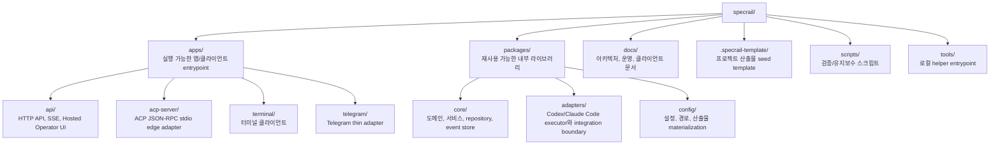
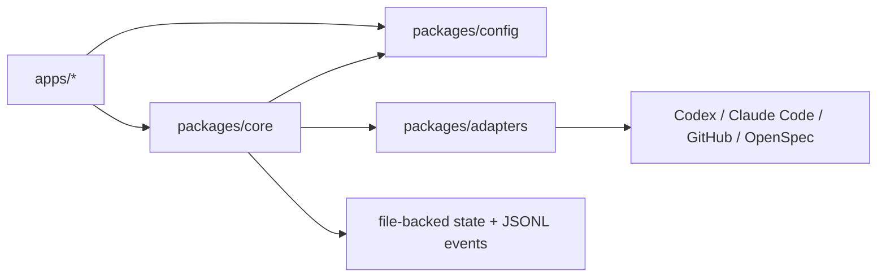
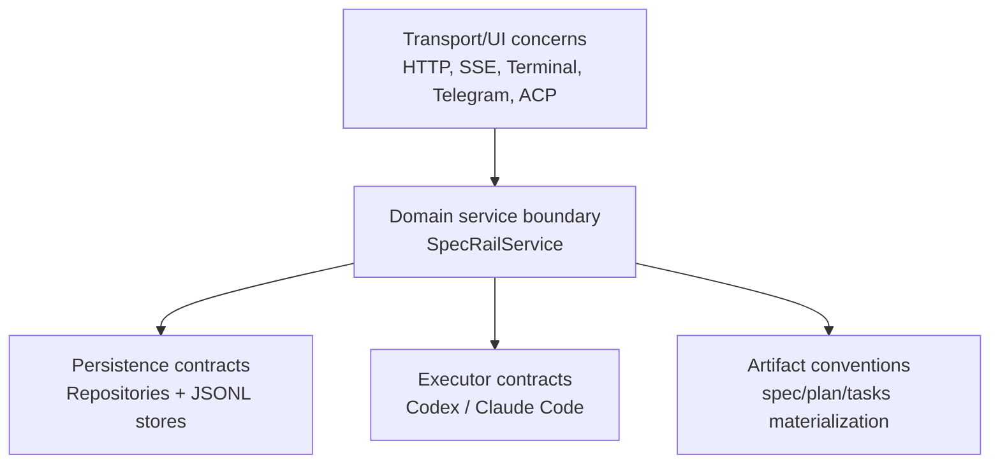

# Repository Structure Rationale

이 문서는 현재 SpecRail monorepo 구조와 각 디렉터리의 책임을 설명한다. 기준은 현재 구현된 MVP이며, 초기 scaffold 의도와 달라진 부분은 현재 코드에 맞춰 정리한다.

## 최상위 구조



## `apps/`

실제 실행 표면을 둔다. 앱은 외부 transport, 사용자 인터페이스, edge protocol을 맡고, 핵심 상태 전이는 `packages/core`의 `SpecRailService`에 위임한다.

### `apps/api/`

책임:

- Node HTTP service boundary
- JSON route handling
- SSE event stream
- request validation과 structured error response
- file-backed dependency wiring
- Codex/Claude Code executor composition
- `GET /operator` Hosted Operator UI serving
- workspace cleanup preview/apply HTTP boundary
- OpenSpec/GitHub-oriented admin wrapper

### `apps/acp-server/`

책임:

- ACP JSON-RPC stdio edge adapter
- ACP session state 저장
- ACP `session/new`, `session/prompt`, `session/cancel`, `session/load`, `session/list`를 SpecRail track/run 흐름으로 매핑
- execution event와 permission request를 ACP client가 이해하는 projection으로 변환

### `apps/terminal/`

책임:

- terminal UI state와 rendering
- track/run list/detail view
- planning/approval workspace view
- backend/profile 선택
- run start/resume/cancel 제어
- live event follow mode
- workspace cleanup preview/apply 조작

### `apps/telegram/`

책임:

- Telegram webhook handling
- chat/thread/user context를 SpecRail project/track/planning session에 바인딩
- attachment reference 등록
- run event relay

## `packages/`

앱 사이에서 공유하는 내부 라이브러리다. transport나 UI의 세부사항보다 도메인 규칙, 저장소 계약, provider adapter 계약을 우선한다.



### `packages/core/`

책임:

- Project, Track, PlanningSession, ArtifactRevision, ApprovalRequest, Execution, ExecutionEvent 도메인 타입
- artifact renderer
- file-backed repositories
- JSONL event store와 planning message store
- `SpecRailService` 유스케이스 orchestration
- workflow/planning/artifact approval/run/channel/attachment 상태 전이

### `packages/adapters/`

책임:

- executor adapter interface
- Codex provider adapter
- Claude Code provider adapter
- provider command/session metadata shape
- provider stream event normalization
- GitHub/OpenSpec integration boundary

### `packages/config/`

책임:

- config loading
- `SPECRAIL_DATA_DIR` 기준 artifact/state/session/workspace 경로 규칙
- `.specrail-template` 기반 artifact materialization
- terminal client config loading

## `docs/`

제품과 구현을 연결하는 durable reference를 둔다.

- `docs/architecture/mvp-architecture.md`: 현재 MVP 시스템 구조, 데이터 흐름, persistence layout, API 범위
- `docs/architecture/mvp-roadmap.md`: 현재 baseline에서 다음 검증/개선 작업 후보
- `docs/domain-entities.md`: 주요 도메인 entity 설명
- `docs/interfaces-and-adapters.md`: adapter boundary와 외부 표면 연결 방식
- client/operation 문서: terminal, ACP, Claude Code, Telegram 등

문서는 실행 가능한 코드와 함께 갱신되어야 한다. API route, event payload, persistence layout, adapter behavior, operator workflow가 바뀌면 관련 문서를 같은 PR/commit에서 업데이트한다.

## `.specrail-template/`

프로젝트 수준 artifact seed template을 둔다.

- `index.md`
- `workflow.md`
- `tracks.md`

트랙별 `spec.md`, `plan.md`, `tasks.md`는 `packages/config`의 materialization helper가 생성한다.

## `scripts/`와 `tools/`

런타임 서비스가 아닌 검증/유지보수/helper entrypoint를 둔다.

예시:

- markdown link 검사
- repository maintenance script
- 로컬 분석/운영 helper

## 왜 단일 패키지가 아닌가?

현재 구현은 이미 다음 경계가 실제 코드로 존재한다.



단일 패키지도 가능하지만, 현재는 다음 이유로 분리가 더 유지보수하기 좋다.

- API/클라이언트 transport 변경이 도메인 상태 전이를 흔들지 않는다.
- executor provider 교체나 확장이 HTTP route를 직접 오염시키지 않는다.
- file-backed persistence를 나중에 database-backed persistence로 바꿀 때 repository 계약을 기준으로 이동할 수 있다.
- Hosted UI, Terminal, Telegram, ACP가 같은 core service를 공유한다.

## 왜 무거운 Nx/Turborepo를 아직 쓰지 않는가?

아직은 과하다.

현재 필요한 것은 다음 정도다.

- pnpm workspace
- TypeScript package build/check
- package-level 테스트
- 가벼운 internal boundary

패키지 수나 CI 복잡도가 커지면 build orchestration 도입을 다시 검토할 수 있다. 지금은 inspectability와 빠른 변경을 우선한다.

## 현재 구조 snapshot

```text
specrail/
  apps/
    acp-server/
      src/
        index.ts
        server.ts
    api/
      src/
        __tests__/
        index.ts
        operator-ui.ts
    telegram/
      src/
        index.ts
    terminal/
      src/
        index.ts
  packages/
    adapters/
      src/
        __tests__/
        interfaces/
        providers/
        index.ts
    config/
      src/
        __tests__/
        artifacts.ts
        index.ts
    core/
      src/
        __tests__/
        domain/
        services/
        errors.ts
        index.ts
  docs/
    architecture/
  .specrail-template/
  scripts/
  tools/
```
