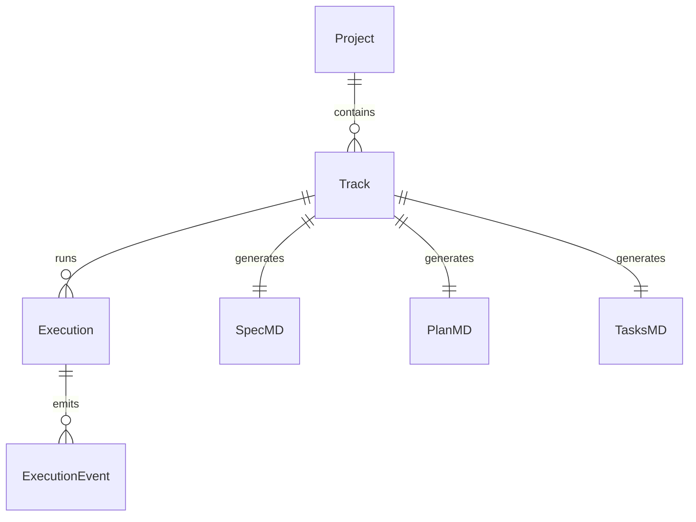
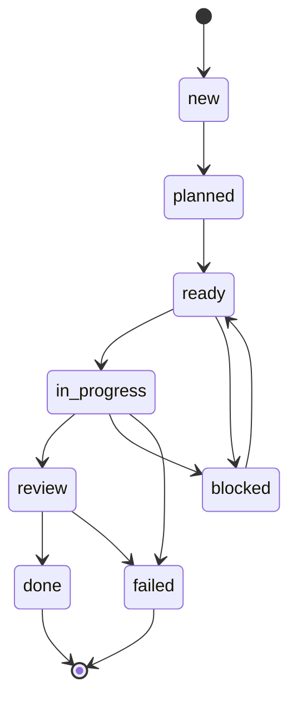
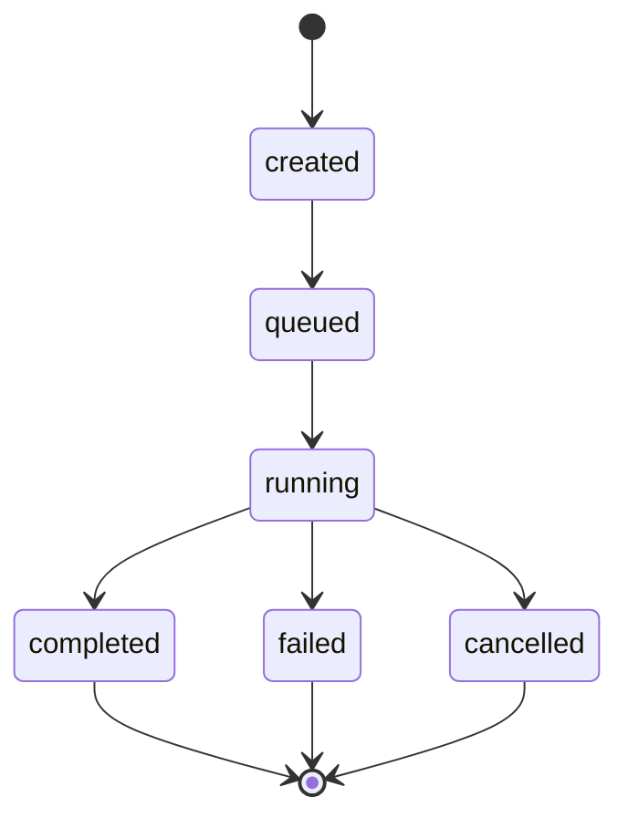

# SpecRail Domain Entities

SpecRail의 핵심 도메인 엔티티를 설명합니다.
타입 정의는 `packages/core/src/domain/types.ts`에 있습니다.

## Entity Relationship

---

## Project

프로젝트의 최상위 컨테이너. 여러 Track을 포함한다.

| Field | Type | Description |
|-------|------|-------------|
| `id` | `string` | 프로젝트 고유 식별자 |
| `name` | `string` | 프로젝트 이름 |
| `repoUrl` | `string?` | 원격 Git 저장소 URL |
| `localRepoPath` | `string?` | 로컬 저장소 경로 |
| `defaultWorkflowPolicy` | `string?` | 기본 워크플로우 정책 |

첫 번째 Track 생성 시 기본 프로젝트가 자동 부트스트랩된다.

---

## Track

하나의 코딩 작업 단위. "이 기능을 만들어줘"라는 요청이 하나의 Track이 된다.

| Field | Type | Description |
|-------|------|-------------|
| `id` | `string` | Track 고유 식별자 |
| `projectId` | `string` | 소속 프로젝트 ID |
| `title` | `string` | 작업 제목 |
| `description` | `string` | 작업 설명 |
| `status` | `TrackStatus` | 워크플로우 상태 |
| `specStatus` | `ApprovalStatus` | 스펙 문서 승인 상태 |
| `planStatus` | `ApprovalStatus` | 플랜 문서 승인 상태 |
| `priority` | `low \| medium \| high` | 우선순위 |

### TrackStatus lifecycle

- `new`: Track 생성 직후
- `planned`: 스펙/플랜 작성 완료
- `ready`: 승인 완료, 실행 대기
- `in_progress`: Run 실행 중
- `blocked`: 실행 취소 또는 장애
- `review`: 실행 완료, 리뷰 대기
- `done`: 작업 완료
- `failed`: 실행 실패

### ApprovalStatus

스펙(`specStatus`)과 플랜(`planStatus`)에 공통 적용되는 승인 상태:

- `draft`: 초안 작성 중
- `pending`: 승인 요청됨
- `approved`: 승인됨
- `rejected`: 반려됨

### Track artifacts

Track 생성 시 3개의 마크다운 아티팩트가 함께 생성된다:

| Artifact | Description |
|----------|-------------|
| `spec.md` | 문제 정의, 목표, 비목표, 제약사항, 수락 기준 |
| `plan.md` | 실행 계획, 단계별 상세, 리스크, 테스트 전략, 승인 상태 |
| `tasks.md` | 태스크 체크리스트 (상태, 우선순위, 담당자, 메모) |

아티팩트의 구조체 정의는 `packages/core/src/domain/artifacts.ts`,
파일 생성 로직은 `packages/config/src/artifacts.ts`에 있다.

---

## Execution (Run)

Track에 대한 코딩 에이전트 실행 인스턴스. 하나의 Track에 여러 Run이 존재할 수 있다 (실패 후 재시도 등).

| Field | Type | Description |
|-------|------|-------------|
| `id` | `string` | 실행 고유 식별자 |
| `trackId` | `string` | 소속 Track ID |
| `backend` | `string` | 실행 백엔드 (현재 `codex`) |
| `profile` | `string` | 실행 프로파일 |
| `workspacePath` | `string` | 작업 디렉토리 |
| `branchName` | `string` | 작업 브랜치 |
| `sessionRef` | `string?` | 실행기 세션 참조 |
| `command` | `CommandExecutionMetadata?` | 실행 명령어 메타데이터 |
| `summary` | `ExecutionSummary?` | 이벤트 요약 |
| `status` | `ExecutionStatus` | 실행 상태 |
| `startedAt` | `string?` | 실행 시작 시각 |
| `finishedAt` | `string?` | 실행 종료 시각 |

### ExecutionStatus lifecycle

### Terminal state reconciliation

Run이 종료되면 Track 상태가 자동 조정된다:

| Run terminal state | Track status |
|--------------------|--------------|
| `completed` | `review` |
| `failed` | `failed` |
| `cancelled` | `blocked` |

### CommandExecutionMetadata

실행기가 실제로 호출한 명령어 정보:

| Field | Type | Description |
|-------|------|-------------|
| `command` | `string` | 실행 명령어 |
| `args` | `string[]` | 명령어 인자 |
| `cwd` | `string` | 작업 디렉토리 |
| `prompt` | `string` | 에이전트에 전달한 프롬프트 |
| `resumeSessionRef` | `string?` | 재개 시 이전 세션 참조 |
| `environment` | `Record<string, string>?` | 환경 변수 |

### ExecutionSummary

| Field | Type | Description |
|-------|------|-------------|
| `eventCount` | `number` | 누적 이벤트 수 |
| `lastEventSummary` | `string?` | 마지막 이벤트 요약 |
| `lastEventAt` | `string?` | 마지막 이벤트 시각 |

---

## ExecutionEvent

Run 실행 중 발생하는 개별 이벤트. JSONL 파일에 append-only로 저장된다.

| Field | Type | Description |
|-------|------|-------------|
| `id` | `string` | 이벤트 고유 식별자 |
| `executionId` | `string` | 소속 Execution ID |
| `type` | `EventType` | 이벤트 타입 |
| `timestamp` | `string` | 발생 시각 |
| `source` | `string` | 이벤트 출처 |
| `summary` | `string` | 이벤트 요약 |
| `payload` | `Record<string, unknown>?` | 추가 데이터 |

### EventType

| Type | Description |
|------|-------------|
| `message` | stdout/stderr 캡처 |
| `tool_call` | 도구 호출 |
| `tool_result` | 도구 호출 결과 |
| `file_change` | 파일 변경 |
| `shell_command` | 셸 명령 실행 |
| `approval_requested` | 승인 요청 |
| `approval_resolved` | 승인 처리 |
| `task_status_changed` | 태스크 상태 변경 |
| `test_result` | 테스트 결과 |
| `summary` | 실행 요약 |

---

## Repository interfaces

각 엔티티에 대응하는 저장소 인터페이스가 `packages/core/src/services/ports.ts`에 정의되어 있다.

| Interface | Methods |
|-----------|---------|
| `ProjectRepository` | `create`, `getById` |
| `TrackRepository` | `create`, `getById`, `list`, `update` |
| `ExecutionRepository` | `create`, `getById`, `list`, `update` |
| `EventStore` | `append`, `listByExecution` |

현재 구현은 파일 시스템 기반(`packages/core/src/services/file-repositories.ts`)이다.
