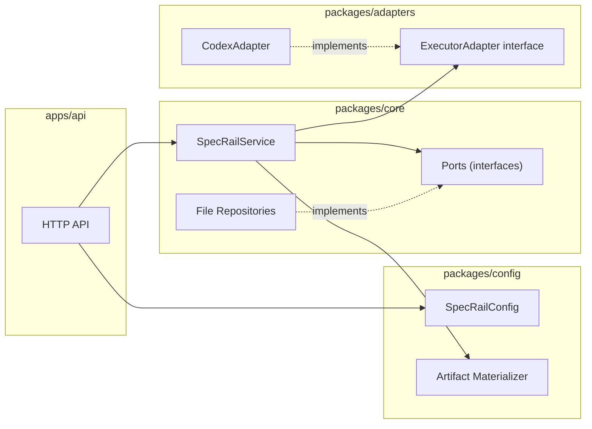
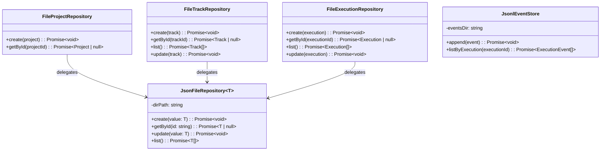
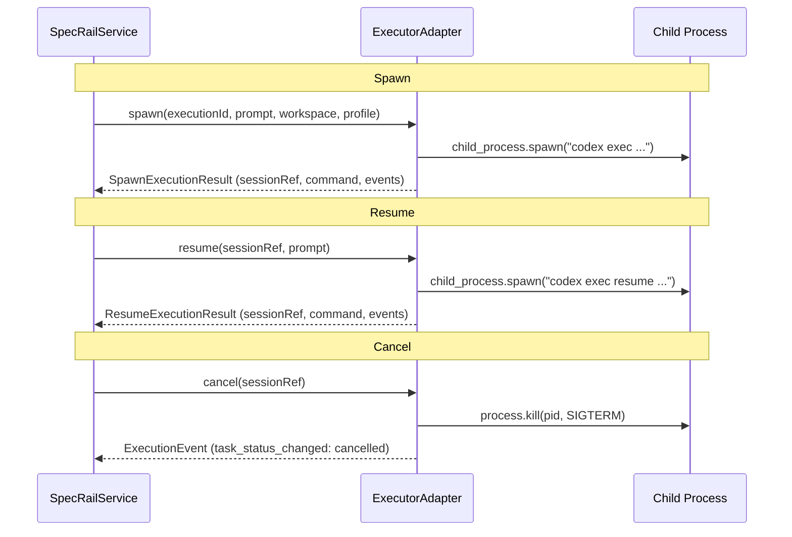
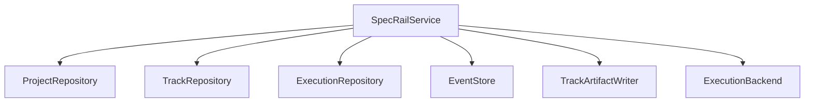

# SpecRail Interfaces & Adapters

SpecRail의 주요 인터페이스(포트)와 어댑터 구현을 설명합니다.
Hexagonal Architecture(Ports & Adapters) 패턴을 따르며, 도메인 로직은 인터페이스에만 의존합니다.

## Architecture Overview



---

## Ports (Repository interfaces)

`packages/core/src/services/ports.ts`에 정의된 저장소 인터페이스입니다.
도메인 서비스(`SpecRailService`)는 이 인터페이스에만 의존하므로, 구현을 교체할 수 있습니다.

### ProjectRepository

| Method | Signature | Description |
|--------|-----------|-------------|
| `create` | `(project: Project) => Promise<void>` | 프로젝트 생성 |
| `getById` | `(projectId: string) => Promise<Project \| null>` | ID로 프로젝트 조회 |

### TrackRepository

| Method | Signature | Description |
|--------|-----------|-------------|
| `create` | `(track: Track) => Promise<void>` | Track 생성 |
| `getById` | `(trackId: string) => Promise<Track \| null>` | ID로 Track 조회 |
| `list` | `() => Promise<Track[]>` | 전체 Track 목록 |
| `update` | `(track: Track) => Promise<void>` | Track 갱신 |

### ExecutionRepository

| Method | Signature | Description |
|--------|-----------|-------------|
| `create` | `(execution: Execution) => Promise<void>` | 실행 레코드 생성 |
| `getById` | `(executionId: string) => Promise<Execution \| null>` | ID로 실행 조회 |
| `list` | `() => Promise<Execution[]>` | 전체 실행 목록 |
| `update` | `(execution: Execution) => Promise<void>` | 실행 레코드 갱신 |

### EventStore

| Method | Signature | Description |
|--------|-----------|-------------|
| `append` | `(event: ExecutionEvent) => Promise<void>` | 이벤트 추가 (append-only) |
| `listByExecution` | `(executionId: string) => Promise<ExecutionEvent[]>` | 실행별 이벤트 목록 |

---

## File Repository Adapters

`packages/core/src/services/file-repositories.ts`에 위치한 파일 시스템 기반 구현입니다.
모든 Repository는 내부적으로 `JsonFileRepository<T>` 제네릭 클래스를 공유합니다.



### Storage layout

```
.specrail-data/state/
  projects/    ← FileProjectRepository  (JSON per project)
  tracks/      ← FileTrackRepository    (JSON per track)
  executions/  ← FileExecutionRepository(JSON per run)
  events/      ← JsonlEventStore        (JSONL per run)
```

- 각 엔티티는 `{id}.json` 파일로 저장됩니다.
- 이벤트는 `{executionId}.jsonl`에 한 줄씩 append됩니다.

---

## ExecutorAdapter interface

`packages/adapters/src/interfaces/executor-adapter.ts`에 정의된 코딩 에이전트 실행기 인터페이스입니다.

### ExecutorAdapter

| Member | Type | Description |
|--------|------|-------------|
| `name` | `string` (readonly) | 어댑터 이름 (e.g. `"codex"`) |
| `capabilities` | `AdapterCapabilities` | 지원 기능 플래그 |
| `spawn` | `(input: SpawnExecutionInput) => Promise<SpawnExecutionResult>` | 새 실행 시작 |
| `resume` | `(input: ResumeExecutionInput) => Promise<ResumeExecutionResult>` | 기존 세션 재개 |
| `cancel` | `(input: CancelExecutionInput) => Promise<ExecutionEvent>` | 실행 취소 |
| `normalize` | `(rawEvent: unknown) => ExecutionEvent \| null` | 원시 이벤트를 정규화 |

### AdapterCapabilities

| Flag | Description |
|------|-------------|
| `supportsResume` | 세션 재개 지원 여부 |
| `supportsStructuredEvents` | 구조화된 이벤트 출력 지원 여부 |
| `supportsApprovalBroker` | 승인 브로커 연동 지원 여부 |

### Spawn/Resume/Cancel flow



---

## CodexAdapter

`packages/adapters/src/providers/codex-adapter.stub.ts`에 위치한 Codex 백엔드 어댑터입니다.

### 주요 동작

| Operation | Description |
|-----------|-------------|
| **spawn** | `codex exec --json` 명령을 자식 프로세스로 실행. 세션 메타데이터를 `sessions/` 디렉토리에 저장 |
| **resume** | 이전 세션의 `codexSessionId`를 찾아 `codex exec resume` 명령 실행 |
| **cancel** | PID에 `SIGTERM` 전송, 세션 메타데이터를 `cancelled` 상태로 갱신 |
| **normalize** | `CodexLifecycleEvent`를 SpecRail `ExecutionEvent`로 변환 |

### Event normalization mapping

| Codex event kind | SpecRail EventType | Summary |
|------------------|--------------------|---------|
| `spawned` | `shell_command` | 세션 생성 |
| `stdout` / `stderr` | `message` | 출력 캡처 |
| `completed` / `failed` | `task_status_changed` | 실행 종료 |
| `resumed` / `cancelled` | `task_status_changed` | 세션 재개/취소 |

### Session persistence

```
.specrail-data/sessions/
  {sessionRef}.json           ← ExecutorSessionMetadata
  {sessionRef}.events.jsonl   ← 어댑터 레벨 이벤트 로그
  {sessionRef}.last-message.txt ← Codex 마지막 메시지
```

---

## TrackArtifactWriter interface

`packages/core/src/services/specrail-service.ts`에 정의된 아티팩트 쓰기 인터페이스입니다.

| Method | Signature | Description |
|--------|-----------|-------------|
| `write` | `(input: TrackArtifactWriterInput) => Promise<void>` | Track의 spec/plan/tasks 아티팩트 파일 생성 |

실제 구현은 `packages/config/src/artifacts.ts`의 `materializeTrackArtifacts` 함수가 담당합니다.
아티팩트는 두 곳에 생성됩니다:

| Location | Purpose |
|----------|---------|
| `.specrail-data/artifacts/tracks/{trackId}/` | 런타임 아티팩트 (내부 관리용) |
| `.specrail/tracks/{trackId}/` | 레포지토리 가시 아티팩트 (Git 커밋 대상) |

---

## SpecRailConfig

`packages/config/src/index.ts`에 정의된 설정 로더입니다.

| Field | Env Variable | Default | Description |
|-------|-------------|---------|-------------|
| `port` | `SPECRAIL_PORT` | `4000` | API 서버 포트 |
| `dataDir` | `SPECRAIL_DATA_DIR` | `.specrail-data` | 런타임 데이터 디렉토리 |
| `repoArtifactDir` | `SPECRAIL_REPO_ARTIFACT_DIR` | `.specrail` | 레포 가시 아티팩트 디렉토리 |

---

## SpecRailService

`packages/core/src/services/specrail-service.ts`에 위치한 핵심 서비스입니다.
모든 인터페이스를 조합하여 비즈니스 로직을 수행합니다.

### Dependencies



### Operations

| Method | Description |
|--------|-------------|
| `createTrack` | Track 생성 + 기본 아티팩트 생성 |
| `getTrack` / `listTracks` / `listTracksPage` | Track 조회 (필터, 정렬, 페이지네이션) |
| `updateTrack` | Track 상태 갱신 (status, specStatus, planStatus) |
| `startRun` | 새 실행 시작 (workspace 생성 → executor spawn → 이벤트 저장) |
| `resumeRun` | 기존 실행 재개 |
| `cancelRun` | 실행 취소 |
| `getRun` / `listRuns` / `listRunsPage` | 실행 조회 (필터, 정렬, 페이지네이션) |
| `listRunEvents` | 실행 이벤트 목록 |
| `recordExecutionEvent` | 외부 이벤트 기록 + 상태 자동 조정 |

Run 종료 시 `reconcileTrackStatusFromRun`으로 Track 상태가 자동 조정됩니다 (`completed→review`, `failed→failed`, `cancelled→blocked`).
